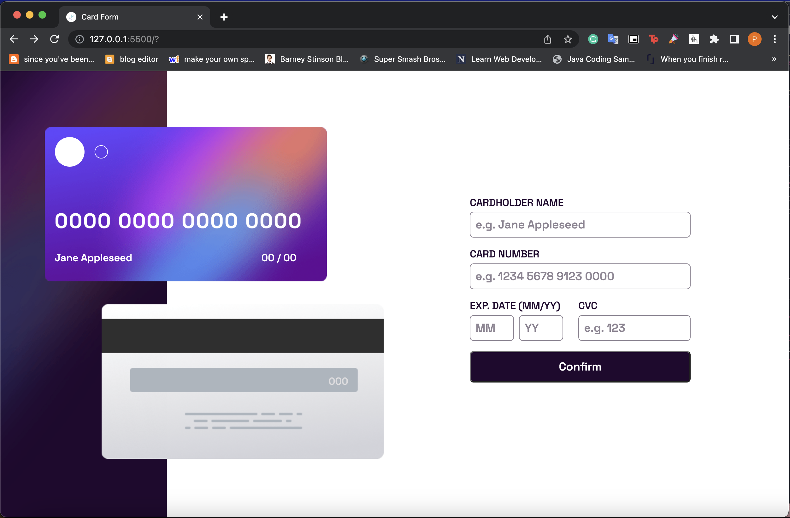

# Interactive card detail solution - HCI

This is a solution to the Interactive card detail page Quiz 2 challenge

## Details 

- FullName - Priscilla Abigail Munthe
- StudentID - 2602109883
- BINUS Email - priscilla.munthe@binus.ac.id

## Result (screenshot & links)

### Links

- Solution URL: (https://github.com/priscillabigaill/interactive-card-details-form)
- Live Site URL: [https://your-live-site-url.com](https://priscillabigaill.github.io/interactive-card-details-form/)

## My process

### Built with

- HTML
- CSS
- Flexbox
- JavaScript

### What I learned

After completing the website clone challenge, I learned a great deal about HTML, CSS, and JS. Through this challenge, I learned how to structure a website using HTML and how to style it using CSS. I also learned about the different elements that can be used in HTML and how to style them using CSS properties such as color, font, and layout. In addition, I learned how to use JS to add interactivity to a website. Overall, this challenge helped me gain a strong foundation in web development.

